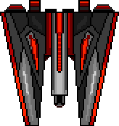
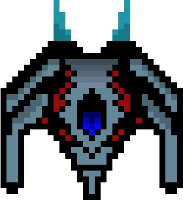
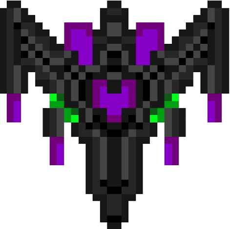
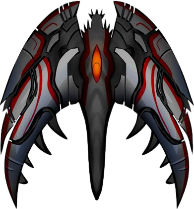
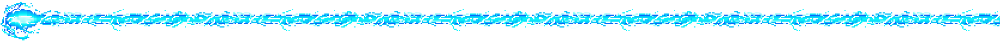
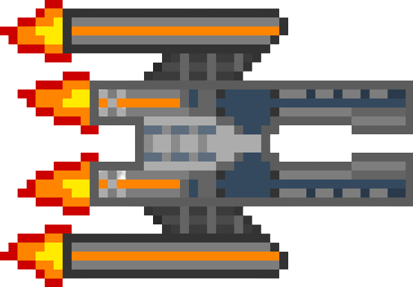
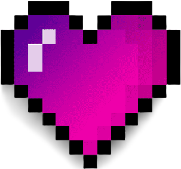

# Spaceship Game

## Objetivo
Durar la mayor cantidad de tiempo vivo esquivando a los enemigos y sus disparos, matando a todos los enemigos que puedas para obtener el mejor puntaje.

## Jugabilidad

Para iniciar el juego tienes que precionar la tecla R.

Al iniciar el juego tienes cinco puntos de vida los cuales puedes ver en la parte superior izquierda; cada que recivas daño de un enemigo por un disparo o al chocar, esta vida se reducira.

Cada que mates a un enemigo obtendras diez puntos, podras ver la cantidad de puntos que has obtenido en el marcador que esta en la parte superior derecha.

Cuando tu vida llegue a cero el juego habra termiando; podras ver tu puntaje actual, el mejor puntaje que has hecho y las veces que has jugado. Para jugar de nuevo debes presionar la tecla R.

---
## Controles

Solo podras desplazarte en un rango entre la mitad de la pantalla hacia abajo.

Para moverte puedes usar los soguientes controles:
* Arriba: Tecla W o Flecha Arriba
* Abajo: Tecla S o Flecha Abajo
* Izquierda: Tecla A o Flecha Izquierda
* Derecha: Tecla D o Flecha Derecha

Para disparar tienes que presionar la tecla de espacio

---
## Enemigos

### *Ship*

#### **Movimiento**

Aparecera en la parte superior e hira cayendo en zig-zag hasta desaparecer.

#### **Ataque**

Dispara balas con cierta cadencia.

#### **Apariencia**
&nbsp;

---
### *Shuttle*

#### **Movimiento**

Aparecera en la parte superior e hira cayendo rebotando en las paredes hasta desaparecer.

#### **Ataque**

Dispara balas con cierta cadencia.

#### **Apariencia**
&nbsp;

---
### *Kamikaze*

#### **Movimiento**

Aparecera en la parte superior y caera a una gran velocidad en linea recta.

#### **Ataque**

El unico daño que podra hacer sera impactando con el jugador.

#### **Apariencia**
&nbsp;

---
### *Traker*

#### **Movimiento**

Aparecera desde cualquiera de los lados en una altura aleatoria mayor al rango donde el juagdor se puede mover, se movera de manera horizontal hacia la mita de la pantalla y despues seguira al jugador de manera horizontal.

#### **Ataque**

Dispara balas con cierta cadencia.

#### **Apariencia**
&nbsp;

---
### *OneShot*

#### **Movimiento**

Aparecera en la parte superior del lado izquierdo bajando hasta una altura aleatoria entre la mitad de la pantalla hasta abajo, al llegar esperará un tiempo, despues dispara y cuando termine, seguira bajando hasta desaparecer.

#### **Ataque**

Dispara un laser en horizontal que atraviesa la pantalla durante un periodo de tiempo, si impacta al jugador le quitara toda la vida.

#### **Apariencia**
&nbsp;

---
## PowerUps

Estos son objetos que te dan bonificaciones extras al recogerlos.

### *Shield*

#### **Aparición**

Aparece cada cierto periodo de tiempo, aparece en cualquier parte arriba y va cayendo hasta desaparecer.

#### **Función**

Te brinda un escudo que te hace inbulnerable a cualquier ataque durante un periodo de tiempo.

---

### *Life*

#### **Aparición**

Aparece cada que eliminas quince enemigos, aparece en cualquier parte arriba y va cayendo hasta desaparecer.

#### **Función**

Te brinda un punto más de vida el cual se sumara a tu vida actual.

